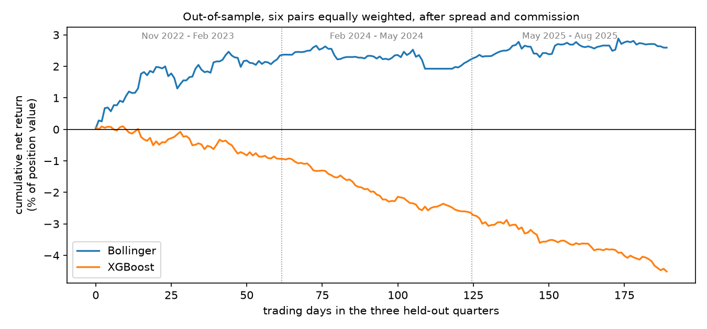
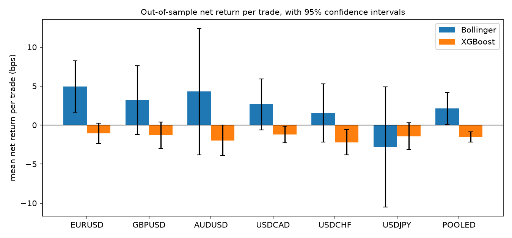

# Forex medium-frequency trading: Bollinger mean reversion vs XGBoost

This project compares two ways of trading six major currency pairs on 15-minute
bars, out of sample and after realistic costs:

1. **Bollinger mean reversion with filters.** A hand-built rule: fade a 2σ band
   touch and exit at the 20-bar mean, taking the trade only when RSI confirms
   and the daily chart is stretched.
2. **XGBoost on triple-barrier labels.** A gradient-boosted classifier that
   predicts whether price will first move 2 ATR up, 2 ATR down, or neither,
   within 4 hours.

Both trade through the same backtest engine on the same bars:

- signal at a bar's close, fill at the next bar's open
- long positions buy at the ask and sell at the bid
- commission charged on every order leg
- 100,000 units of the base currency per trade

## Test design

The held-out data is **three calendar quarters that neither method saw while
being built.** They come from a time split fixed before any model was trained:
16 three-month chunks starting 2022-05-26.

| Role | Dates (UTC) |
|---|---|
| Training | 2022-05-26 → 2026-06-03, excluding the test quarters below |
| XGBoost validation (early stopping and trade threshold) | 2026-02-26 → 2026-06-03, part of the training side |
| **Test** | **2022-11-26 → 2023-02-26, 2024-02-26 → 2024-05-26, 2025-05-26 → 2025-08-26** |

One trading day (96 bars) on each side of every test boundary is excluded from
both training and test.

Every free choice was made on the training side only:

- **Bollinger:** the configuration was chosen from 12 candidates by the
  t-statistic of its training-side net return per trade:
  - filter combination: none, RSI, daily regime, or both
  - band width: 2.0σ or 2.5σ
  - RSI thresholds: 30/70 or 25/75
  
  It selected **both filters, 2.0σ bands, RSI 30/70**.
- **XGBoost:** of the four feature subsets fixed before training, the one with
  the lowest validation log-loss (all 135 features) was used unchanged. It
  enters when |P(up) − P(down)| > θ. θ = 0.10 was chosen on the validation
  quarter from {0, 0.05, …, 0.30}.
  - Exits mirror the label: take-profit and stop at ±2 ATR, or after 16 bars.
  - The model was trained on EURUSD and is applied to all six pairs; its
    features have no price units.

## Out-of-sample results





Bps are net of spread and commission, as a share of trade value. Sharpe is
annualized from daily returns. Max drawdown is in percentage points of
position value. "Pooled" means all six pairs, equally weighted.

| Bollinger (both filters) | Trades | Net bps/trade | t-stat | Sharpe | Max DD | Hit rate |
|---|---:|---:|---:|---:|---:|---:|
| EURUSD | 146 | +4.93 | 2.93 | 3.35 | −1.35 | 71.9% |
| GBPUSD | 128 | +3.21 | 1.43 | 1.48 | −2.37 | 65.6% |
| AUDUSD | 61 | +4.30 | 1.04 | 1.12 | −1.69 | 68.9% |
| USDCAD | 118 | +2.65 | 1.58 | 1.96 | −0.81 | 73.7% |
| USDCHF | 149 | +1.56 | 0.82 | 0.90 | −1.45 | 65.8% |
| USDJPY | 134 | −2.81 | −0.71 | −0.87 | −6.84 | 60.4% |
| **Pooled** | **736** | **+2.12** | **2.01** | **1.98** | **−0.73** | **67.5%** |

| XGBoost | Trades | Net bps/trade | t-stat | Sharpe | Max DD | Hit rate |
|---|---:|---:|---:|---:|---:|---:|
| EURUSD | 305 | −1.06 | −1.56 | −1.72 | −5.20 | 46.6% |
| GBPUSD | 279 | −1.29 | −1.50 | −1.78 | −4.51 | 49.5% |
| AUDUSD | 302 | −1.96 | −1.96 | −2.30 | −7.25 | 47.7% |
| USDCAD | 297 | −1.22 | −2.25 | −2.51 | −3.77 | 45.8% |
| USDCHF | 267 | −2.22 | −2.68 | −3.42 | −6.31 | 43.4% |
| USDJPY | 326 | −1.42 | −1.62 | −2.04 | −4.78 | 45.4% |
| **Pooled** | **1,776** | **−1.52** | **−4.57** | **−4.98** | **−4.61** | **46.4%** |

**Difference, Bollinger minus XGBoost, pooled:** +3.64 bps per trade.
- Welch test on per-trade returns: z = 3.28, p = 0.001.
- Paired test on daily returns: t = 3.64, p < 0.001.
- Bollinger is ahead on 5 of 6 pairs; USDJPY shows no difference (p = 0.87).

**By test quarter** (pooled net bps per trade, t-stat in brackets):

| Quarter | Bollinger | XGBoost |
|---|---:|---:|
| Nov 2022 – Feb 2023 | +4.82 (2.29) | −0.94 (−1.24) |
| Feb 2024 – May 2024 | −0.32 (−0.24) | −1.68 (−4.35) |
| May 2025 – Aug 2025 | +1.11 (0.67) | −1.92 (−3.64) |

All tables are in [`results/`](results/).

## Conclusion

- **Bollinger beat XGBoost out of sample.** The difference is +3.64 bps per
  trade (p ≈ 0.001), and Bollinger is ahead on five of six pairs. XGBoost has
  no edge: its gross return (+0.20 bps per trade) is far below its costs
  (1.72 bps), so it loses about its costs.
- **Bollinger was profitable on the held-out quarters, but the evidence for a
  durable edge is weak.**
  - Pooled return is +2.12 bps per trade after costs. The t-stat is 2.01
    (p ≈ 0.04), which is borderline significant.
  - The gain comes mostly from the first test quarter. The other two quarters
    are not significantly different from zero.
  - Only EURUSD is significant on its own, and USDJPY loses.
  - On the 3¼-year training side, the same configuration lost −0.15 bps per
    trade (t = −0.32).
  - The held-out result is a positive reading on 190 trading days. It is not a
    demonstrated, persistent profit.

**Not modelled:** overnight financing (swap), slippage beyond the quoted spread,
and position sizing. The candidate grid comes from earlier research on the full
history, so some selection bias remains even though the final choice used
training data only. p-values use the normal approximation. The XGBoost model
was trained on EURUSD only and applied unchanged to all six pairs. A longer,
rolling walk-forward test is future work.

## How to run

You need Python 3.11 or 3.12 and [uv](https://docs.astral.sh/uv/). For a
plain-pip setup, see `requirements.txt`.

```bash
uv sync                                              # environment from uv.lock
uv run pytest                                        # tests; no market data needed
uv run python scripts/demo_synthetic_backtest.py     # full feature pipeline + engine on synthetic bars
```

### Plugging in your own data

Market data is not included. The pipeline needs **1-minute BID and 1-minute
ASK bars for each pair**, stored as monthly parquet files:

```
data/raw/<PAIR>/bid/<YYYY-MM>.parquet
data/raw/<PAIR>/ask/<YYYY-MM>.parquet
```

Each file has columns `timestamp` (bar start, UTC), `open`, `high`, `low`,
`close` and `volume` (optional, unused). To convert a CSV or parquet file into
this layout, run:

```bash
uv run python scripts/import_bars.py --pair EURUSD --side bid --file eurusd_bid_1min.csv
uv run python scripts/import_bars.py --pair EURUSD --side ask --file eurusd_ask_1min.csv
```

### Reproducing the comparison

Run these in order. Each script documents its inputs and outputs.

```bash
uv run python scripts/resample_15min.py              # 15-min bars + features
uv run python scripts/resample_clock.py              # 30-min / 1h bars + features
uv run python scripts/resample_session_intraday.py   # 2h / 4h bars + features
uv run python scripts/resample_daily_weekly.py       # daily / weekly bars + features
uv run python scripts/build_moments_features.py      # 15-min frame: skew / kurtosis family
uv run python scripts/build_htf_features.py          # + higher-timeframe and regime columns
uv run python scripts/build_excursion_features.py    # + band-excursion history
uv run python scripts/build_triple_barrier_labels.py # EURUSD labels
uv run python scripts/build_training_events.py       # training set
uv run python scripts/build_split.py                 # the time split
uv run python scripts/train_first_models.py          # XGBoost models
uv run python scripts/head_to_head.py --data-root data --out results
uv run python scripts/make_figures.py --results results
```

`head_to_head.py` uses the split dates listed above, which assume data from
mid-2021 to mid-2026. For a different period, adjust `CHUNK_EDGES` and
`TEST_CHUNKS` in the script.

## Layout

```
src/fxalgo/backtest/    engine (t+1 fills, bid/ask, commission, intrabar TP/SL, time exits), cost model, metrics
src/fxalgo/strategies/  Bollinger mean reversion + RSI / daily-regime / cost filters, closed-bar alignment
src/fxalgo/features/    causal features (bands, RSI, ATR, trend, spread, time, higher-timeframe, moments, excursions)
src/fxalgo/labels/      triple-barrier labels
src/fxalgo/training/    training events and the purged, embargoed time split
src/fxalgo/models/      XGBoost fitting, feature subsets, evaluation metrics
src/fxalgo/data/        storage layout, data-quality checks, resampling
scripts/                pipeline, head-to-head, figures, data import, synthetic demo
results/                head-to-head tables and figures
```

Research project, not financial advice.
